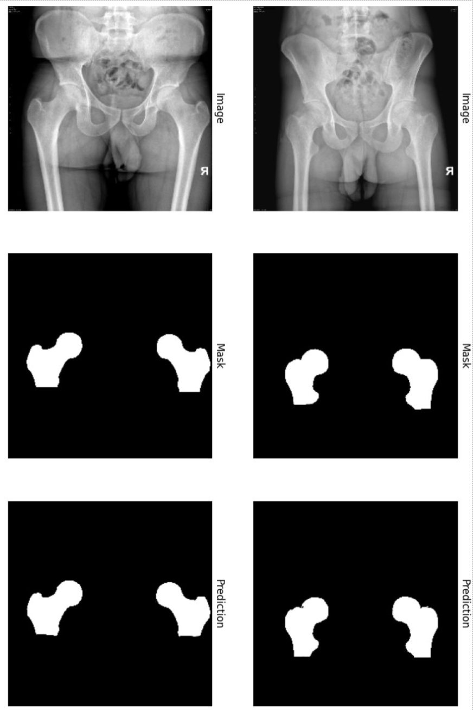

# [Your Project Title Here]

## Repository Link

[https://github.com/savenger/xray_segmentation]

## Description

In this project we were given x ray images of the lower body / pelvis area. The images were in NIfTI format and providing labels of different bone types e.g. femur. The goal was to be able to do image segmentation and successfully segment out the femur bones in an x ray image.

### Task Type

Image Classification / Image Segmentation

### Results Summary

- **Best Model:** U-net
- **Evaluation Metric:** Dice-Coefficient
- **Result:** [99,4% accuracy, Dice of 96,3%]

## Documentation

1. **[Literature Review](0_LiteratureReview/README.md)**
2. **[Dataset Characteristics](1_DatasetCharacteristics/exploratory_data_analysis.ipynb)**
3. **[Baseline Model](2_BaselineModel/baseline_model.ipynb)**
4. **[Model Definition and Evaluation](3_Model/model_definition_evaluation)**
5. **[Presentation](4_Presentation/README.md)**

## Cover Image

